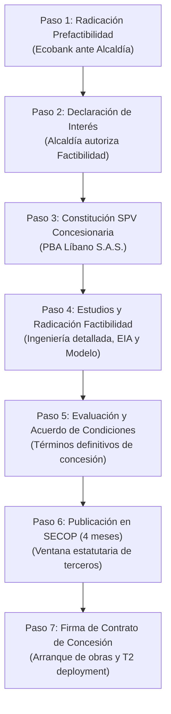

# Estructura Institucional y Marco Legal — Concesión APP
## Régimen de Asociaciones Público Privadas de Iniciativa Privada
### Ley 1508 de 2012 y Decreto 1082 de 2015 · PBA Líbano, Tolima
**Ecobank Development Colombia S.A.S. — Originador**  
*Data Room Edition · Septiembre 2026*

---

## 1. Fundamento Normativo del Proyecto

El marco de contratación y estructuración del proyecto se rige por la **Ley 1508 de 2012** (Estatuto de Asociaciones Público Privadas) y su decreto reglamentario único para el sector de contratación pública, el **Decreto 1082 de 2015** (modificado por el Decreto 438 de 2021).

El esquema adoptado es el de **Asociación Público-Privada de Iniciativa Privada sin desembolso de recursos públicos**, caracterizado por:
1. **Riesgo y Financiación Privada:** El 100% del capital requerido para las fases de prefactibilidad, factibilidad, obras civiles, reposición de maquinaria y capital de trabajo es asumido por el concesionario privado.
2. **Aporte Estatal en Especie:** La contraparte pública (Municipio de Líbano) aporta la entrega material y jurídica de la infraestructura y el predio existente de la planta de beneficio animal para su explotación económica exclusiva durante el plazo del contrato (Decreto 1082, Art. 2.2.2.1.5.1 §2 y Art. 2.2.2.1.3.2).
3. **Fuente de Retribución:** La remuneración del inversionista y del concesionario proviene exclusivamente de la explotación económica del activo (tarifas de servicios y comercialización de subproductos cárnicos e industriales).
4. **Plazo Improrrogable:** 30 años de concesión, plazo máximo legal autorizado por el Artículo 6 de la Ley 1508 de 2012.

---

## 2. Ruta Procedimental Legal de la Iniciativa Privada

### Detalle de las Etapas Estatutarias:

* **Etapa 1 — Prefactibilidad (Art. 2.2.2.1.5.2):**  
  Presentación del alcance mínimo del proyecto, diagnóstico de ingeniería básica, estimación inicial de costos por ciclo de vida, identificación de riesgos y esquema de financiamiento preliminar.
* **Etapa 2 — Pronunciamiento de la Entidad (Art. 2.2.2.1.5.4):**  
  La Alcaldía Municipal cuenta con un plazo legal de hasta tres (3) meses para emitir su concepto de viabilidad, declarar el proyecto de interés municipal y autorizar el paso a factibilidad.
* **Etapa 3 — Factibilidad (Art. 2.2.2.1.5.5):**  
  Elaboración de estudios geotécnicos, diseño de ingeniería de detalle, plan de manejo ambiental, levantamiento georreferenciado, modelo financiero cerrado y borrador de minuta de contrato.
* **Etapa 4 — Acuerdo de Condiciones (Art. 2.2.2.1.5.7):**  
  Negociación y suscripción de los términos contractuales finales, incluyendo niveles de servicio, fórmulas de ajuste tarifario y la contraprestación fija municipal del 5%.
* **Etapa 5 — Publicación SECOP y Manifestación de Interés (Art. 2.2.2.1.5.11):**  
  Publicación oficial del proyecto durante **cuatro (4) meses** en la plataforma pública de contratación (SECOP). Si ningún tercero calificado manifiesta interés, la entidad adjudica el contrato de forma **directa** al originador. Si un tercero calificado se presenta, se realiza un proceso de selección abreviada donde el originador ostenta el **derecho de preferencia** para igualar o mejorar la oferta (Art. 2.2.2.1.5.12).

---

## 3. Articulación Municipal y Concejo de Líbano

Conforme a la **Ley 136 de 1994** (Art. 32, modificado por Ley 1551 de 2012, Art. 18), la Alcaldesa Municipal requiere autorización del Concejo Municipal para:
1. **Comprometer vigencias que excedan su periodo constitucional** (contrato de concesión a 30 años).
2. **Entregar en concesión un bien de propiedad municipal** para su explotación por un particular.

Al tratarse de un municipio de **6ª Categoría**, las sesiones ordinarias del Concejo sesionan estatutariamente en **febrero, mayo, agosto y noviembre**. El trámite del proyecto de acuerdo de iniciativa de la Alcaldía está programado para la sesión ordinaria de **noviembre de 2026**, asegurando la firmeza jurídica previa a la suscripción del contrato de concesión.

---

## 4. Estructura de Capital y Vehículos Corporativos

1. **Originador (Ecobank Development Colombia S.A.S.):**  
   Sociedad colombiana que estructura la iniciativa privada, radica la prefactibilidad y acredita la capacidad legal y experiencia de estructuración.
2. **Vehículo Concesionario Operativo (PBA Líbano S.A.S.):**  
   Compañía receptora constituida en Colombia una vez declarada la viabilidad por la Alcaldía (Paso 2). Será la titular exclusiva del contrato de concesión, titular de las cuentas bancarias de recaudo y receptora de la inversión de capital.
3. **Vehículo de Inversión (SPV):**  
   Sociedad de Propósito Especial constituida en Estados Unidos (Florida LLC) que canaliza la inversión internacional hacia PBA Líbano S.A.S. mediante operaciones cambiarias debidamente registradas ante el Banco de la República como Inversión Extranjera Directa (IED).
