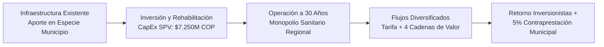

# Resumen Ejecutivo de Inversión — PBA Líbano
## Asociación Público-Privada (Iniciativa Privada) · Concesión a 30 Años
### Rehabilitación, Modernización y Operación Sostenible · Municipio de Líbano, Tolima
**Ecobank Development Colombia S.A.S. — Originador**  
*Data Room Edition · Septiembre 2026*

---

## 1. Tesis de Inversión y Visión del Proyecto

El proyecto **Planta de Beneficio Animal (PBA) Líbano** consiste en la estructuración, financiación, rehabilitación técnica, modernización tecnológica y operación en concesión a **30 años** del centro de faenamiento y procesamiento cárnico del Municipio de Líbano, Tolima.

El activo operará como una planta de **Categoría Nacional ante INVIMA** (Decreto 2270 de 2012, Art. 11), transformando una infraestructura municipal existente en el principal polo agroindustrial y sanitario de beneficio bovino del norte del departamento del Tolima.



---

## 2. Ventajas Competitivas y Barreras de Entrada (Moat)

1. **Monopolio Sanitario Regulado:**  
   El Decreto 2270 de 2012 y el Decreto 1975 de 2019 exigen que toda carne para consumo humano provenga exclusivamente de plantas con autorización sanitaria nacional. La estricta regulación sanitaria y los costos de capital impiden la proliferación de plantas clandestinas o municipales precarias, consolidando la demanda regional de forma cautiva.
2. **Cuenca Ganadera Cautiva (12 Municipios / 165.488 Cabezas):**  
   El área de influencia directa abarca 12 municipios contiguos del norte del Tolima (Líbano, Murillo, Villahermosa, Santa Isabel, Armero-Guayabal, Lérida, Venadillo, Piedras, Anzoátegui, Ambalema, Herveo y Casabianca), que concentran un inventario bovino superior a **165.488 cabezas** (Censo Pecuario ICA 2023), ofreciendo una cobertura de materia prima de entre **87% y 131%** respecto al throughput máximo proyectado.
3. **Contrato de Concesión a Largo Plazo (30 Años):**  
   Estructurado bajo la Ley 1508 de 2012 (Régimen de APP), modalidad de iniciativa privada sin desembolso de recursos públicos, otorgando exclusividad operativa sobre el activo municipal por tres décadas.
4. **Infraestructura y Predio Libre de Pasivos:**  
   El predio es de propiedad exclusiva del Municipio del Líbano (Matrícula Inmobiliaria 364-917), y la Oficina de Contratación Municipal ha certificado formalmente que no existen contratos vigentes de mantenimiento ni gravámenes de paso a terceros (`FO-GDC-A03-13`).
5. **Permiso Ambiental en Regla:**  
   Cuenta con permiso de vertimientos otorgado por CORTOLIMA (Resolución 1910/2022), suspendido administrativamente y listo para reactivación y ajuste técnico durante la etapa de obra de la nueva PTAR y biodigestor.

---

## 3. Modelo Operativo y Cadenas de Valor Integradas

El proyecto supera el modelo tradicional de cobro exclusivo por degüello mediante un enfoque de bioeconomía circular con cinco fuentes de monetización:

| Línea de Negocio | Descripción Operativa | Margen y Naturaleza |
|---|---|---|
| **1. Servicio de Faenamiento** | Tarifa de sacrificio y refrigeración obligatoria bajo estándar INVIMA. | Flujo de caja base recurrente y predecible. |
| **2. Cadena de Cueros y Pieles** | Clasificación, desuello mecánico y salado industrial para proveeduría a curtiembres. | Captura de valor por calidad de preservación. |
| **3. Procesamiento de Sangre** | Fraccionamiento de sangre fresca en plasma alimenticio y hemoglobina. | Mercado industrial de alimentos y nutrición animal. |
| **4. Subproductos y Harinas** | Renderizado de huesos, sebos y decomisos para harinas proteicas y sebos industriales. | Alto margen y eliminación de costos de disposición. |
| **5. Bioenergía y Compostaje** | Biodigestor anaeróbico y tratamiento de contenido ruminal para generación de biogás y abonos. | Autoconsumo térmico/eléctrico y venta de biofertilizante. |

---

## 4. Parámetros Económicos y Financieros Clave

* **Throughput Operativo:**  
  * *Fase de Arranque (Y0–Y1):* 14 reses/día (~1.610 a 6.840 cabezas/año).  
  * *Régimen Pleno (Y11 en adelante):* 80 reses/día (~22.800 cabezas/año), conservadoramente estabilizado por debajo de la capacidad histórica de la planta (120 reses/día).
* **CapEx de Inversión Total:**  
  * **$7.250M COP** aportados por el vehículo de inversión privada (SPV) para obras civiles, línea mecanizada de faenado, cuartos fríos y PTAR.  
  * **$15.350M COP** de CapEx total ciclo de vida a 29 años (incluyendo reinversiones operativas y reposición de equipos), superando el umbral legal de 6.000 SMMLV.
* **Contraprestación Municipal:** **5% de EBITDA** pagadero al Municipio del Líbano, fijado contractualmente.
* **Estructura Societaria:**  
  * Concesionario Operativo: **PBA Líbano S.A.S.** (empresa receptora colombiana).  
  * Originador / Gestor Operativo: **Ecobank Development Colombia S.A.S.**  
  * Vehículo de Inversión: Sociedad de Propósito Especial (SPV).

---

## 5. Cronograma de Hitos Inmediatos

```text
[Sep 2026]           [Oct 2026]           [Nov 2026]           [Dic 2026]           [May-Jul 2027]
Radicación           Aprobación           Votación Concejo     Cierre Ronda         Firma Contrato
Prefactibilidad      Declaración          Autorización         Presale (T1)         Concesión APP
(Paso 1)             Interés (Paso 2)     Vigencias Futuras    Estudios Factib.     y Cierre Financiero
```

Para mayor detalle sobre los aspectos jurídicos, prediales, ambientales y contractuales, consulte los módulos técnicos de este Data Room.
