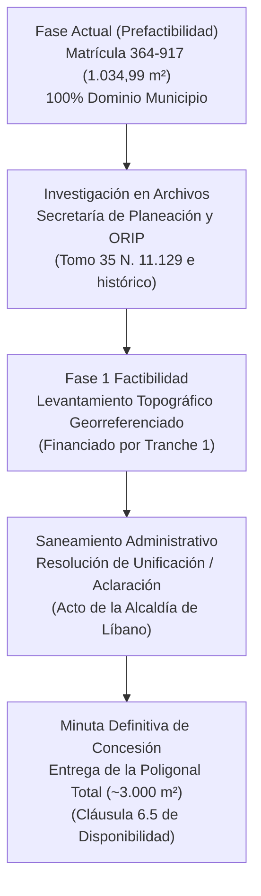

# Plan de Reconciliación de Cabida y Área Operativa
## Reconciliación entre Área Titulada (1.034,99 m²) y Huella Material (~3.000 m²)
### Planta de Beneficio Animal, Municipio de Líbano, Tolima
**Ecobank Development Colombia S.A.S. — Data Room Edition**  
*Septiembre 2026*

---

## 1. Planteamiento de la Situación Predial

Al cotejar los títulos de propiedad inmobiliaria con los levantamientos de ingeniería de la planta, se identifica la siguiente situación física y registral:

* **Área Registrada en Folio:** La **Matrícula Inmobiliaria No. 364-917** delimita una cabida de **1.034,99 m²**, correspondiente al lote principal donde se asienta el edificio del matadero (según linderos de la Escritura No. 109 de 1979).
* **Huella Operativa Material:** El levantamiento técnico de redes de servicios (informe LOD 500) y la visita técnica de la Gobernación del Tolima (agosto de 2024) evidencian que la infraestructura integral de la planta —incluyendo corrales de recepción y pesaje, rampa de desembarque, báscula camionera, planta de tratamiento de aguas residuales (PTAR), biodigestor anaeróbico, zona de amortiguamiento ambiental y vías internas de circulación— ocupa un polígono continuo cercado de aproximadamente **~3.000 m²**.

---

## 2. Diagnóstico Jurídico y Pista Histórica ("Keep Digging")

Esta discrepancia entre área registrada y huella construida es un fenómeno común en activos de infraestructura pública municipal construidos en las décadas de 1960 a 1980 en Colombia.

La investigación de títulos realizada sobre la Matrícula 364-917 arrojó una pista registral fundamental:
> *«CON BASE EN LAS SIGUIENTES MATRICULAS: TOMO 35 N. 11.129»*

1. **Predio de Mayor Extensión Original (1959):**  
   El Municipio del Líbano adquirió un predio de mayor extensión en 1959 a la señora Emelina Gálvez Vda. de Millán (Escritura 935 del 23/09/1959, registrada en el **Tomo 35 N. 11.129**). Al constituir EMPOLÍBANO LTDA en 1979 (Escritura 109), se segregó formalmente el lote del edificio (1.034,99 m²), mientras que las zonas aledañas de corrales y servicios continuaron bajo el dominio municipal como bien fiscal o mayor extensión no desenglobada.
2. **Desarrollo Urbano San Antonio:**  
   El predio colinda con la Urbanización San Antonio. El suelo contiguo sobre el que se ubican los accesos y el talud de protección ambiental corresponde a cesiones obligatorias públicas y bienes fiscales consolidados del Municipio.

---

## 3. Hoja de Ruta para Factibilidad y Cierre Contractual

La reconciliación de cabida no bloquea la prefactibilidad y cuenta con una ruta técnica y legal definida para la etapa de Factibilidad (conforme al Decreto 1082 de 2015, Art. 2.2.2.1.5.5 núm. 2.6):

1. **Paso 1 — Investigación Registral y Catastral Activa:**  
   Se radicó ante la Secretaría de Planeación la solicitud de búsqueda en los libros del antiguo sistema sobre el **Tomo 35 N. 11.129** para certificar la cabida total de la compraventa municipal de 1959.
2. **Paso 2 — Levantamiento Georreferenciado (Factibilidad - Fase 1):**  
   Financiado con los recursos de la ronda de capital inicial (Tranche 1), se realizará un levantamiento topográfico de precisión con coordenadas MAGNA-SIRGAS que determine la poligonal exacta de ocupación actual (~3.000 m²).
3. **Paso 3 — Acto Administrativo de Saneamiento y Delimitación:**  
   Con base en el levantamiento, la Alcaldía Municipal expedirá el acto administrativo de alinderamiento, aclaración o unificación de cabida predial previo a la firma del contrato.
4. **Blindaje Contractual:**  
   La Cláusula 6.5 del borrador de contrato de concesión establece la **Obligación de Disponibilidad**, en virtud de la cual el Municipio garantiza la entrega material y jurídica del inmueble en su totalidad, saneado y apto para la ejecución del proyecto, asignando el riesgo de saneamiento predial inicial al Estado (R-08 en la Matriz CONPES 3714).
